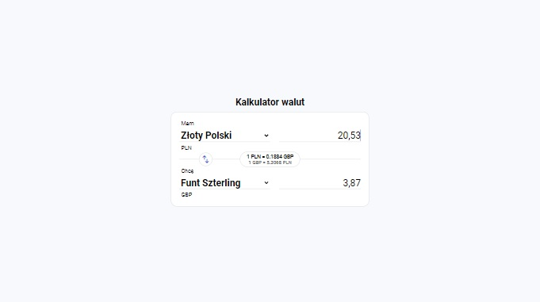
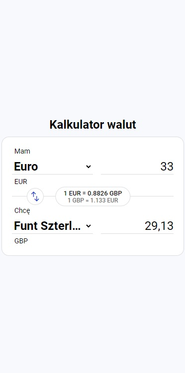

# Currency Converter

## Table of contents
* [Technologies](#technologies)
* [Screenshots](#screenshots)
* [Installation](#installation)
* [Available scripts](#available-scripts)
* [Live demo](#live-demo)

## Technologies
| Tech                                                    | Description                              |
| ------------------------------------------------------- | ---------------------------------------- |
| [TypeScript](https://www.typescriptlang.org/)                           | TypeScript is a strongly typed programming language that builds on JavaScript   |
| [Sass](https://sass-lang.com/)                           | Professional grade CSS extension   |
| [Vite](https://vitejs.dev/)                           | build tool that aims to provide a faster and leaner development experience   |


## Screenshots
<p align="center">
    
</p>

<p align="center">
    
</p>

## Installation

```bash
git clone https://github.com/MobbySchiller/burger-creator.git
npm install
npm run dev
```

## Available scripts
| Command                   | Description                   |
| ------------------------- | ----------------------------- |
| `npm run dev`           | Open local server             |
| `npm run build`           | Create optimized build        |
| `npm run preview`            | Run local server on build version                    |

## Live demo
[Click here](https://mobbyschiller.github.io/currency-converter/)
